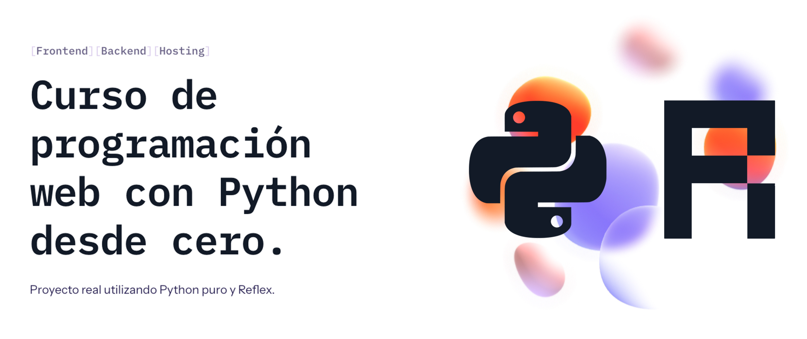

# Python Web

[](https://python.org)
[](https://reflex.dev)

## Curso de 13 horas en vídeo para aprender desarrollo web con Python puro y Reflex desde cero.



### Proyecto realizado durante emisiones en directo desde [Twitch](https://twitch.tv/mouredev)
> ##### Si consideras útil el curso, apóyalo haciendo "★ Star" en el repositorio. ¡Gracias!

## Sobre el curso: muy importante

Desde la versión 0.4.0, Reflex utiliza [Radix](https://www.radix-ui.com/) (en vez de [Chakra](https://chakra-ui.com/)) como sistema de componentes de UI. Ten en cuenta la versión que usas del framework, ya que algunos elementos han podido cambiar ligeramente. Te recomiendo que revises el [código](./link_bio) del proyecto original actualizado. A partir de la versión 0.4.0, todos los componentes de Chakra estarán en `rx.chakra`.

Ejemplo:

```
import reflex as rx
rx.button() # Ahora este será el botón de Radix
rx.chakra.button() # Anterior botón de Chakra
```

Aquí tienes [un artículo](https://reflex.dev/blog/2024-02-16-reflex-v0.4.0) con toda la información sobre la nueva versión.

## Curso de Python Web: Tutorial en vídeo

<a href="https://youtu.be/n2YrGsXJC6Y"></a>

- [Curso de Python Web](https://youtu.be/n2YrGsXJC6Y)
- [Lección 1 - Introducción](https://youtu.be/n2YrGsXJC6Y&t=272)
- [Lección 2 - Características](https://youtu.be/n2YrGsXJC6Y&t=1147)
- [Lección 3 - Instalación](https://youtu.be/n2YrGsXJC6Y&t=1551)
- [Lección 4 - Primeros pasos](https://youtu.be/n2YrGsXJC6Y&t=3043)
- [Lección 5 - Fundamentos](https://youtu.be/n2YrGsXJC6Y&t=3442)
- [Lección 6 - Hola mundo](https://youtu.be/n2YrGsXJC6Y&t=4259)
- [Lección 7 - Componentes](https://youtu.be/n2YrGsXJC6Y&t=4593)
- [Lección 8 - Maquetación](https://youtu.be/n2YrGsXJC6Y&t=6805)
- [Lección 9 - Estilos](https://youtu.be/n2YrGsXJC6Y&t=9190)
- [Lección 10 - Colores e iconos](https://youtu.be/n2YrGsXJC6Y&t=13807)
- [Lección 11 - Fuentes](https://youtu.be/n2YrGsXJC6Y&t=15124)
- [Lección 12 - Imágenes](https://youtu.be/n2YrGsXJC6Y&t=16249)
- [Lección 13 - Fuentes remotas](https://youtu.be/n2YrGsXJC6Y&t=17505)
- [Lección 14 - Diseño responsive](https://youtu.be/n2YrGsXJC6Y&t=18225)
- [Lección 15 - Accesibilidad](https://youtu.be/n2YrGsXJC6Y&t=19058)
- [Lección 16 - Despliegue](https://youtu.be/n2YrGsXJC6Y&t=19283)
- [Próximos pasos](https://youtu.be/n2YrGsXJC6Y&t=20892)

> Tienes un canal llamado **"python"** en el servidor de **[Discord](https://mouredev.com/discord)** de la comunidad para preguntar, compartir y ayudar.

## Curso de Python Web Avanzado: Tutorial en vídeo

<a href="https://youtu.be/bNy8OZJfA6I"></a>

- [Curso de Python Web avanzado](https://youtu.be/bNy8OZJfA6I)
- [Lección 1 - Refactorización](https://youtu.be/bNy8OZJfA6I&t=212)
- [Lección 2 - Actualización datos](https://youtu.be/bNy8OZJfA6I&t=716)
- [Lección 3 - Router](https://youtu.be/bNy8OZJfA6I&t=1181)
- [Lección 4 - Componentes React](https://youtu.be/bNy8OZJfA6I&t=2945)
- [Lección 5 - Hosting nativo](https://youtu.be/bNy8OZJfA6I&t=3843)
- [Lección 6 - Backend](https://youtu.be/bNy8OZJfA6I&t=4032)
- [Lección 7 - Docker](https://youtu.be/bNy8OZJfA6I&t=4789)
- [Lección 8 - CORS](https://youtu.be/bNy8OZJfA6I&t=6801)
- [Lección 9 - GitHub Actions](https://youtu.be/bNy8OZJfA6I&t=7344)
- [Lección 10 - Infraestructura](https://youtu.be/bNy8OZJfA6I&t=8013)
- [Lección 11 - API](https://youtu.be/bNy8OZJfA6I&t=8234)
- [Lección 12 - Estados](https://youtu.be/bNy8OZJfA6I&t=8768)
- [Lección 13 - Integración API](https://youtu.be/bNy8OZJfA6I&t=9190)
- [Lección 14 - Datos en tiempo real](https://youtu.be/bNy8OZJfA6I&t=12429)
- [Lección 15 - Supabase y PostgreSQL](https://youtu.be/bNy8OZJfA6I&t=13743)
- [Lección 16 - JSON serializable](https://youtu.be/bNy8OZJfA6I&t=15853)
- [Lección 17 - Base de datos](https://youtu.be/bNy8OZJfA6I&t=16693)
- [Lección 18 - Feature flags](https://youtu.be/bNy8OZJfA6I&t=18045)
- [Lección 19 - Query PostgreSQL](https://youtu.be/bNy8OZJfA6I&t=19002)
- [Lección 20 - Cálculo de fechas](https://youtu.be/bNy8OZJfA6I&t=19275)
- [Lección 21 - Migración RadixUI](https://youtu.be/bNy8OZJfA6I&t=21284)
- [Lección 22 - Carga de datos](https://youtu.be/bNy8OZJfA6I&t=22745)
- [Lección 23 - Cliente / Servidor](https://youtu.be/bNy8OZJfA6I&t=23061)
- [Lección 24 - Animaciones](https://youtu.be/bNy8OZJfA6I&t=23611)
- [Lección 25 - Otras características](https://youtu.be/bNy8OZJfA6I&t=23877)
- [Próximos pasos](https://youtu.be/bNy8OZJfA6I&t=24438)

## Proyecto

<a href="https://moure.dev"></a>
<a href="./link_bio"></a>

Durante el curso aprenderemos desarrollo web con Python puro utilizando el framework [Reflex](https://github.com/reflex-dev/reflex). Realizaremos un proyecto práctico que consistirá en desarrollar y publicar mi nueva web de links [moure.dev](https://moure.dev/) (añadiéndole nuevas funcionalidades).
Todo el código está disponible para que cualquiera pueda usarlo.

### 💻 [Accede al código del proyecto](./link_bio)

## Tutorial extra en vídeo (+3 horas)

<a href="https://youtu.be/h8Tn0ITRoQs"></a>

Proyecto práctico extra de código libre que consistirá en desarrollar y publicar la web del [Calendario de aDEViento](https://adviento.dev/) de la comunidad. Una activdad donde repartimos cursos y libros sobre programación en Navidad.

### 💻 [Accede al código del proyecto extra](https://github.com/mouredev/adeviento-web)

## Otros proyectos creadas con Reflex

Estas son otras webs de código libre que he desarrollado para que puedas consultar su código y funcionalidades.

[](https://github.com/mouredev/adeviento-web)

[](https://github.com/mouredev/retos-programacion-web)

[](https://github.com/mouredev/hola-mundo-day-web)

[](https://github.com/mouredev/portafolio-template)

## Información importante y preguntas frecuentes

Todo el contenido se ha creado en directo desde [Twitch](https://www.twitch.tv/mouredev), y en este repositorio podrás encontrar las clases en vídeo, el código programado, enlaces de interés y la información relevante.

* Es un curso desde cero y no necesitas conocimientos previos sobre desarrollo web.
* Recuerda que he creado en el [Discord](https://discord.gg/mouredev) un canal "🐍python" para que puedas comentar lo que quieras.

## Enlaces de interés

* [Web oficial de Python](https://www.python.org/)
* [Web oficial de Reflex](https://reflex.dev/)
* [Documentación oficial de Reflex](https://reflex.dev/docs/)
* [Repositorio en GitHub de Reflex](https://github.com/reflex-dev/reflex)
* [Visual Studio Code](https://vscode.dev/)
* [Documentación CSS](https://www.w3schools.com/css/)
* [Curso de CSS](https://web.dev/learn/css/)
* [Chakra UI](https://chakra-ui.com/)
* [Google Fonts](https://fonts.google.com/)
* [Font Awesome](https://fontawesome.com/)
* [Vercel](https://vercel.com/)
* [Radix UI](https://www.radix-ui.com/)
* [Ant Design](https://ant.design/)
* [Railway](https://railway.app/)
* [Twitch API](https://dev.twitch.tv/docs/api/)
* [Supabase](https://supabase.com/)
* [ConfigCat](https://configcat.com/)

## Curso de Python desde cero
### Aprende Python desde sus fundamentos

<a href="https://github.com/mouredev/hello-python"></a>

Si quieres aprender desde cero, tienes gratis todos los tutoriales que he creado. Más de 44 horas desde fundamentos, frontend, backend o integración con IA.

[](https://github.com/mouredev/hello-python)

Si quieres unirte a nuestra comunidad de desarrollo, aprender programación de Apps, mejorar tus habilidades y ayudar a la continuidad del proyecto, puedes encontrarnos en:

[](https://twitch.tv/mouredev)
[](https://mouredev.com/discord)
[](https://moure.dev)

##  Hola, mi nombre es Brais Moure.
### Freelance full-stack iOS & Android engineer

[](https://youtube.com/mouredevapps?sub_confirmation=1)
[](https://twitch.com/mouredev)
[](https://mouredev.com/discord)
[](https://twitter.com/mouredev)


Soy ingeniero de software desde 2010. Desde 2018 combino mi trabajo desarrollando Apps con la creación de contenido formativo sobre programación y tecnología en diferentes redes sociales como **[@mouredev](https://moure.dev)**.

### En mi perfil de GitHub tienes más información

[](https://github.com/mouredev)
