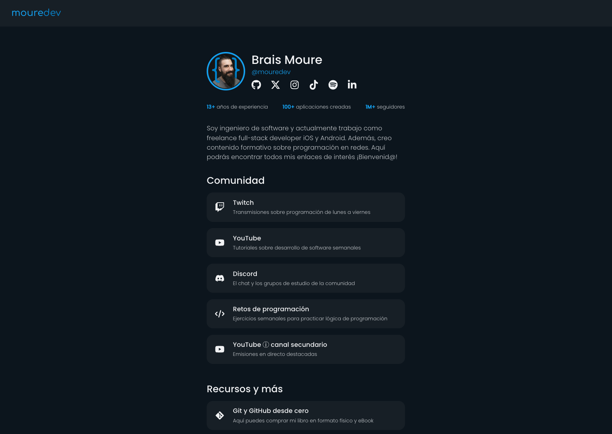
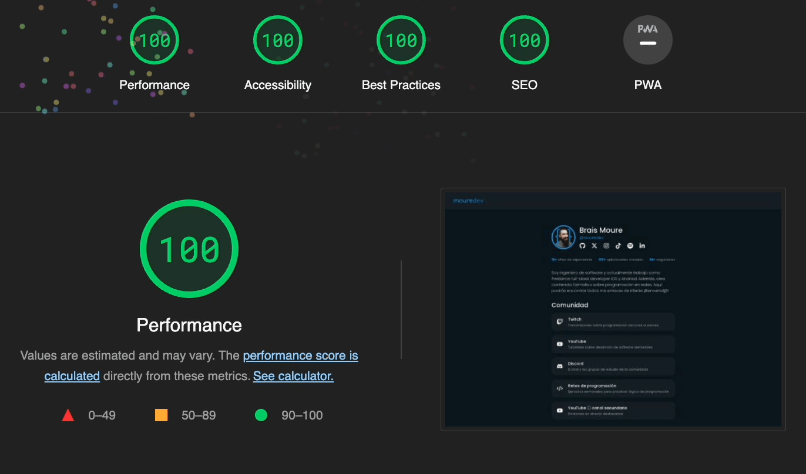

# Web de links de MoureDev

[](https://python.org)
[](https://fastapi.tiangolo.com)

## Proyecto desarrollado con [Python](https://www.python.org/) y [Reflex](https://reflex.dev/) que representa un sitio web personal estilo "[link in bio](https://moure.dev/)"




## Sobre el curso: muy importante

Desde la versión 0.4.0, Reflex utiliza [Radix](https://www.radix-ui.com/) (en vez de [Chakra](https://chakra-ui.com/)) como sistema de componentes de UI. Ten en cuenta la versión que usas del framework, ya que algunos elementos han podido cambiar ligeramente. Te recomiendo que revises el [código](./link_bio) del proyecto original actualizado. A partir de la versión 0.4.0, todos los componentes de Chakra estarán en `rx.chakra`.

Ejemplo:

```
import reflex as rx
rx.button() # Ahora este será el botón de Radix
rx.chakra.button() # Anterior botón de Chakra
```

Aquí tienes [un artículo](https://reflex.dev/blog/2024-02-16-reflex-v0.4.0) con toda la información sobre la nueva versión.

## Tutorial

Consulta el [curso](../README.md) de 6 horas en vídeo desde cero que muestra el proceso de desarrollo de la web.

## Requisitos

#### Instala y crea un entorno virtual [venv](https://packaging.python.org/en/latest/guides/installing-using-pip-and-virtual-environments/) en la raíz del proyecto
Mac/Linux: `python3 -m pip install virtualenv`

Windows: `py -m pip install --user virtualenv`

`python3 -m venv .venv`

#### Activa el entorno virtual 
Mac/Linux: `source .venv/bin/activate`

Windows: `.\.venv\Scripts\activate`

Para desactivar el entorno virtual: `deactivate`

## Dependencias
*(Con el entorno virtual activo)*

`pip install reflex`

También las tienes en `requirements.txt`

`python -m pip install -r requirements.txt`

## Ejecución
`reflex run`

`reflex run --loglevel debug` *(modo debug)*

Acceder a [http://localhost:3000](http://localhost:3000) (frontend) y a [http://localhost:8000](http://localhost:8000) (backend)

## Despliegue


### Frontend

c contiene las instrucciones necesarias para empaquetar el frontend del proyecto y desplegarlo de forma estática. Éste, en concreto, desde [Vercel](https://vercel.com/). Se ejecuta automáticamente desde una [GitHub Action](../.github/workflows/static_build.yml) creada en el repositorio.

`sh remote_build.sh`

```bash
cd link_bio
python -m venv .venv
source .venv/bin/activate
pip install --upgrade pip
pip install -r requirements.txt
rm -rf frontend
reflex init
API_URL=[URL backend, en caso de existir] reflex export --frontend-only
unzip frontend.zip -d frontend
rm -f frontend.zip
deactivate
```

*Prepera el entorno, instala dependencias, inicializa el proyecto, crea la construcción de producción, y la descomprime.*

Existe otro script llamado `local_build.sh` para realizar construcciones del frontend en local. En caso de existir un backend, debe referenciarse con un valor en `API_URL`, como aparece en el script `remote_build.sh`.

> El proyecto se puede desplegar en cualquier proveedor o servidor que soporte recursos estáticos.
> 
> [moure.dev](https://moure.dev) se encuentra desplegado en [Vercel](https://vercel.com).

Configuración en Vercel:

* Se ha asociado el repositorio de GitHub al proyecto (para que cada `push` en la rama `main` desencadene un nuevo despliegue)
* Build & Development Settings: Other
* Root Directory: `public` (que contiene el empaquetado estático para producción)
* Custom Domain: moure.dev 

### Backend

El fichero `Dockerfile` posee la configuración para generar la imagen y desplegar el backend como un contedor de Docker.
Éste, en concreto, desde [Railway](https://railway.app/).

`Dockerfile`

```yaml
FROM python:3.11

WORKDIR /app
COPY . .

ENV VIRTUAL_ENV=/app/.venv_docker
ENV PATH="$VIRTUAL_ENV/bin:$PATH"
RUN python3.11 -m venv $VIRTUAL_ENV

RUN pip install --upgrade pip
RUN pip install --no-cache-dir -r requirements.txt

CMD reflex run --env prod --backend-only
```

*Prepara una image con Python, instala las dependencias del proyecto e inicia el proceso que ejecuta el backend.*

> El proyecto se puede desplegar en cualquier proveedor o servidor que soporte Python o Docker. Incluso frontend y backend en un mismo hosting o contenedor de Docker.
> 
> [api.moure.dev](https://api.moure.dev) se encuentra desplegado en [Railway](https://railway.app/).

Configuración en Railway:

* Se ha asociado el repositorio de GitHub al proyecto (para que cada `push` en la rama `main` desencadene un nuevo despliegue)
* Root Directory: `/link_bio` (que contiene el `Dockerfile`)
* Variables: `PORT=8000` (el puerto en el que escucha por defecto el backend)
* Custom Domain: api.moure.dev 